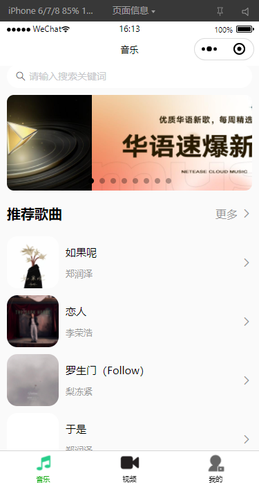
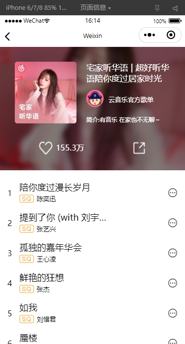
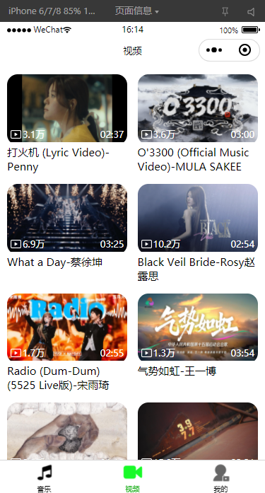
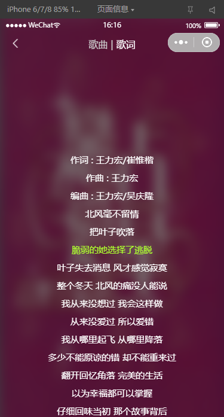
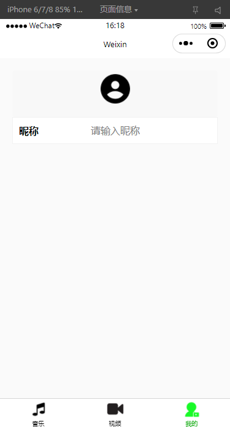
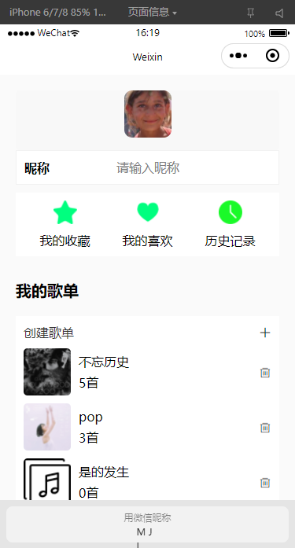

# 网易云音乐微信小程序

## 📖 项目简介

这是一个**基于微信小程序的网易云音乐客户端项目**，完整实现了音乐播放、视频浏览、歌单管理、搜索等核心功能。项目采用原生小程序开发，结合 Vant Weapp UI 组件库，实现了流畅的音乐播放体验和精美的界面设计。

## 跟codewhy老师学习

## 🖼️ 项目展示

### 音乐首页部分展示




### 歌单列表部分展示



### 视频部分展示




### 音乐播放器部分展示




### 个人中心部分展示





## 🛠️ 技术栈

### 核心技术

- **微信小程序原生开发**：使用小程序原生框架开发
- **Vant Weapp**：轻量、可靠的小程序 UI 组件库
- **hy-event-store**：轻量级状态管理库
- **underscore**：JavaScript 工具库
- **微信云开发**：云函数实现用户身份认证

### 技术亮点

- **组件化开发**：抽离 10+ 个可复用组件（song-item、video-item、ranking-item 等）
- **状态管理**：使用 hy-event-store 管理播放器、歌单、排行榜等全局状态
- **分包加载**：播放器页面独立分包，优化首屏加载速度
- **网络请求封装**：统一管理 API 请求（music.js、video.js、player.js）
- **音频管理**：封装微信音频 API，实现播放控制、进度管理、歌词同步
- **路由管理**：TabBar 导航 + 页面路由完整体验
- **云函数应用**：使用云函数获取用户 OpenID
- **懒加载优化**：配置 lazyCodeLoading 按需加载组件

## 📚 核心功能

### 音乐模块

- ✅ 音乐推荐（轮播图、推荐歌单、新歌速递）
- ✅ 排行榜展示（热歌榜、新歌榜、飙升榜等）
- ✅ 歌单详情查看
- ✅ 音乐播放器（播放/暂停、上一曲/下一曲、进度控制）
- ✅ 歌词滚动显示
- ✅ 播放模式切换（顺序、随机、单曲循环）

### 视频模块

- ✅ 视频列表浏览
- ✅ 视频详情播放
- ✅ 视频评论查看

### 搜索模块

- ✅ 歌曲搜索
- ✅ 搜索历史记录
- ✅ 热门搜索推荐

### 个人中心

- ✅ 用户信息展示
- ✅ 收藏歌单管理
- ✅ 播放历史

## 💡 优化

- ✅ **分包加载**：播放器页面独立分包，减少主包体积
- ✅ **懒加载**：按需加载组件，提升性能
- ✅ **组件复用**：封装多种样式的 song-item 组件
- ✅ **状态管理**：全局状态管理，避免页面间数据传递
- ✅ **请求封装**：统一的网络请求管理和错误处理
- ✅ **音频管理**：完整的音频播放控制逻辑
- ✅ **云函数**：服务端获取用户身份，保证安全性
- ✅ **UI 组件库**：使用 Vant Weapp 提升开发效率

## 🚀 快速开始

### 环境要求

- 微信开发者工具
- Node.js（用于安装 npm 包）

### 安装依赖

```bash
# 安装项目依赖
npm install

# 构建 npm 包
# 在微信开发者工具中：工具 -> 构建 npm
```

### 配置云开发

1. 在微信开发者工具中开通云开发
2. 创建云环境
3. 上传云函数：
   - 右键 `cloudfunctions/getOpenid` → 上传并部署：云端安装依赖

### 运行项目

1. 使用微信开发者工具打开项目
2. 填入自己的 AppID
3. 点击"编译"按钮
4. 在模拟器或真机预览

### 注意事项

- 本项目需要配置合法的服务器域名才能正常请求网易云音乐 API
- 云函数需要在微信开发者工具中单独上传部署
